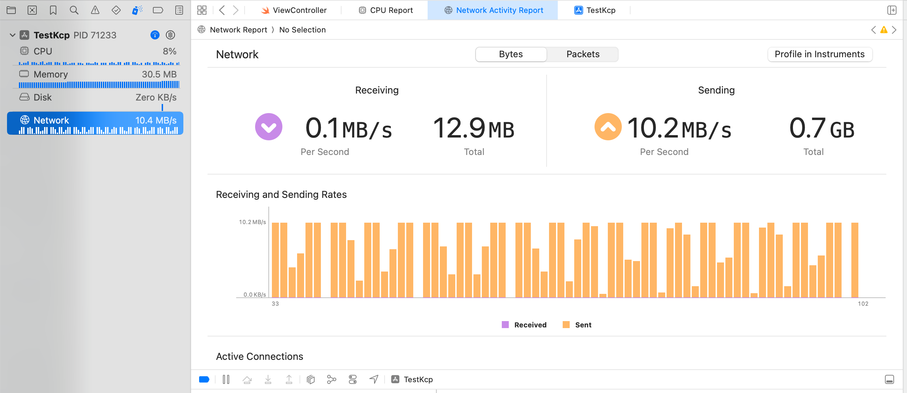

# swift-tokio-kcp

`swift-tokio-kcp` provides [kcp](https://github.com/skywind3000/kcp) network communication capabilities to swift.

Kcp is a fast and reliable ARQ protocol targeting low latency network communication and is expected to work more stable than TCP in network environments with certain packet loss. `swift-tokio-kcp` is a binding of [tokio_kcp](https://github.com/Matrix-Zhang/tokio_kcp).

## Features

- Since the core part of kcp communication is handled by tokio_kcp, which is a rust implementation, `swift-tokio-kcp` is expected to offer **better performance**, i.e. low latency and reduces cpu/memory consumption, compared to pure swift implementations.



- The exported swift package contains only pre-built libraries, so you don't need a rust environment to use this package. See the code in tags for detail, e.g. [tag 0.1.0](https://github.com/oyyd/swift-tokio-kcp/tree/0.1.0).

- Disadvantage: Since the binding is deliveried through `uniffi-rs` and other reasons, it currently has to be built as a static lib which could increase the size of your application to about `9.6MB`.

## Example

Client example:

```swift
import TokioKcp

func clientExample() async throws {
  // Initialize a tokio runtime. This should be done only once before you de-init the runtime.
  // You can call `KcpStream.deinitTokioRuntime()` to de-init the runtime.
  try await KcpStream.initTokioRuntime()

  // Create a kcp stream that will conncet to 127.0.0.1:3100.
  let stream = KcpStream(addr: "127.0.0.1:3100")
  // Set kcp conifg. You can also manually modify `stream.config` before `connect()`.
  stream.setFastestConfig()
  // Connect the stream.
  try await stream.connect()
  let dataToWrite = "Hello!".data(using: .utf8)!
  // Write some data to the remote.
  try await stream.write(data: dataToWrite)
  // Read some data from the remote.
  let data = try await stream.read()
  print("[client] receive: \(String(data: data, encoding: .utf8)!)")
}
```

You can also start a kcp server for testing if you don't have one:
```swift
import TokioKcp

func serverExample() async throws {
  // Should call `KcpStream.initTokioRuntime()` if you don't have.

  // Create a kcp listener that will bind to 0.0.0.0:3100.
  let listener = KcpListener(addr: "0.0.0.0:3100")
  // Set kcp conifg. You can also manually modify `listener.config` before `bind()`.
  listener.setFastestConfig()
  // Bind the listener.
  try await listener.bind()

  while true {
    do {
      // Accept new clients
      let stream = try await listener.accept()
      Task {
        // Use the stream to write or read some data to/from the remote.
        // ....
      }
    } catch {
      print("failed to accept stream, error \(error)")
    }
  }
}
```

## Build from Source

Run the prepare and build scripts below:

```bash
make prepare-apple
cd bindings
make apple
```

Then, the swift package can be found in the `output` folder.

## References

- [tokio_kcp](https://github.com/Matrix-Zhang/tokio_kcp/) A Kcp implementation for tokio
- [kcp](https://github.com/skywind3000/kcp) KCP - A Fast and Reliable ARQ Protocol
- [uniffi-rs](https://github.com/mozilla/uniffi-rs/) a multi-language bindings generator for rust
- [uniffi-rs-fullstack-examples](https://github.com/imWildCat/uniffi-rs-fullstack-examples/) Build Rust for Android and iOS (with potential for all mobile platforms, Windows, Mac and Web*)

## License
MIT
